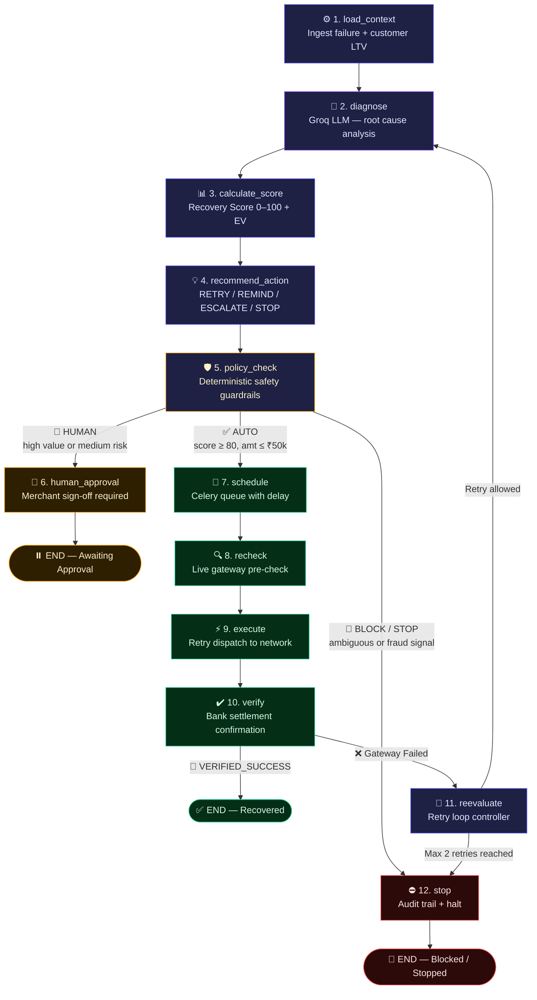
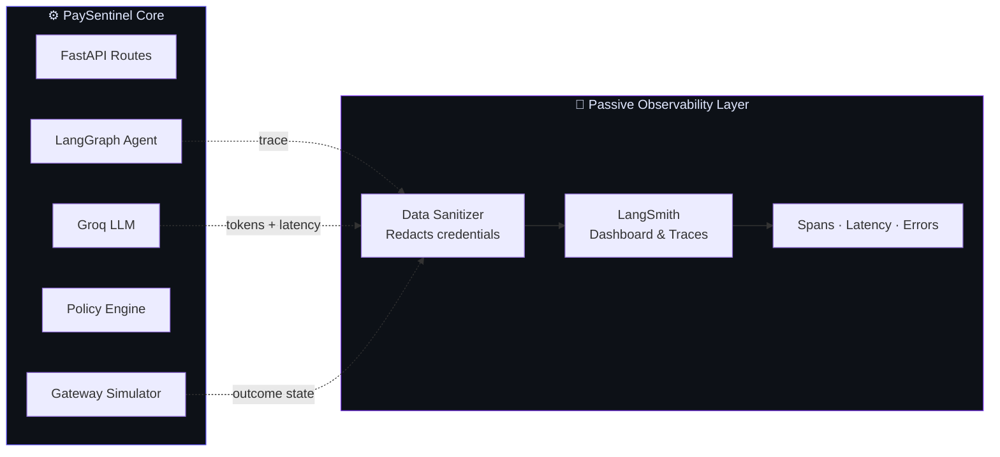
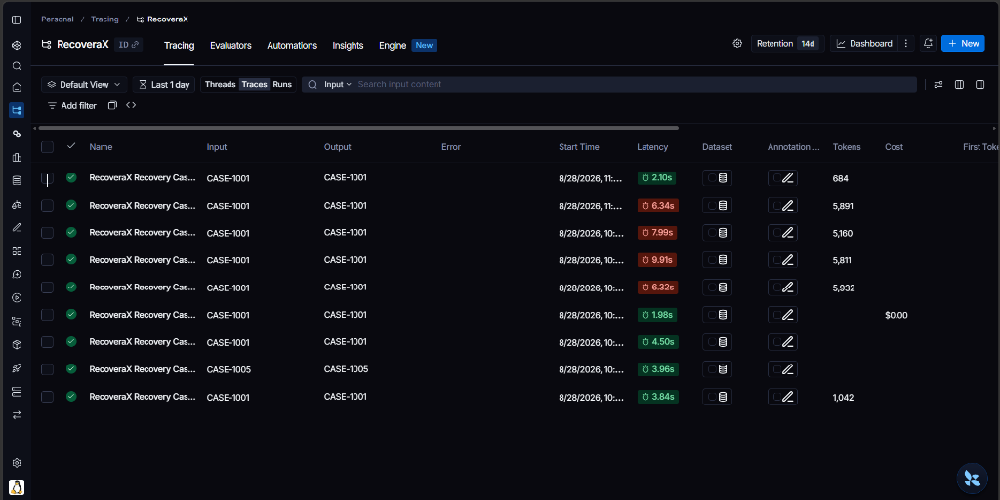
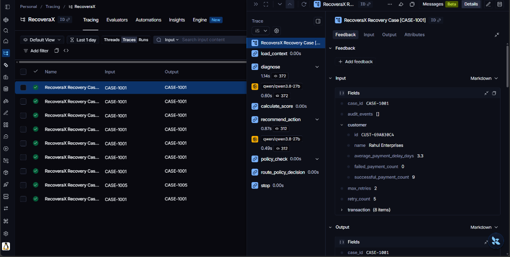

<div align="center">

# 🛡️ PaySentinel
### Autonomous AI Revenue Recovery Engine

**LangGraph · Groq Qwen 27B · Deterministic Safety Guardrails · Human-in-the-Loop · LangSmith Observability**

[](https://python.org)
[](https://fastapi.tiangolo.com)
[](https://nextjs.org)
[](https://langchain-ai.github.io/langgraph)
[](LICENSE)

---

*"The AI recommends. The policy engine authorizes. Humans control the risk."*

</div>

---

## What is PaySentinel?

Every failed payment is revenue walking out the door. Most systems either blindly retry — causing double-charges and bank dishonor fees — or do nothing at all.

**PaySentinel is a production-grade autonomous AI agent that recovers failed payments safely.** It uses a Groq LLM to diagnose *why* a payment failed, a deterministic Python policy engine to authorize *what* to do next, and a LangGraph stateful graph to *execute* the recovery — with human operators in the loop for every high-risk decision.

```
DIAGNOSE  →  SCORE  →  RECOMMEND  →  POLICY CHECK  →  HUMAN REVIEW  →  EXECUTE  →  VERIFY
```

> The LLM never touches money. The policy engine has final authority. Execution is blocked until authorization is satisfied.

---

## Benchmark Results — 1,000 Synthetic Payment Cases

| Metric | Naive Blind Retry | PaySentinel (Guardrailed) | Lift |
| :--- | :---: | :---: | :---: |
| Revenue Recovered | ₹12.5L | **₹34.8L** | **+₹22.3L** |
| Recovery Rate | 25.0% | **69.6%** | **+44.6pp** |
| Duplicate Debits | 14 violations | **0 violations** | **100% safe** |
| High-value cases auto-approved | Uncontrolled | **0 (all reviewed)** | Full HITL control |
| Operator Review Queue | None | **713 cases routed** | Risk-aware routing |

> Metrics are from synthetic benchmark simulation. Not live production data.

---

## Architecture

### Core Safety Contract

```
┌─────────────────────────────────────────────────────────────────┐
│                     SAFETY HIERARCHY                            │
│                                                                 │
│   Groq LLM          →   Diagnoses & Recommends ONLY            │
│   Policy Engine     →   Authorizes or Blocks (deterministic)   │
│   Human Operator    →   Reviews all high-value / risk cases     │
│   Executor          →   Acts only after full authorization      │
│                                                                 │
│   Fail-closed guarantee: ambiguous state → BLOCK, never AUTO   │
└─────────────────────────────────────────────────────────────────┘
```

### LangGraph Workflow — 12-Node Cyclic Agent



### Node Reference Table

| # | Node | Engine | Responsibility |
| :- | :--- | :---- | :------------- |
| 01 | `load_context` | Data Layer | Ingests transaction failure, customer LTV, payment history, gateway error codes into `RecoveryState` |
| 02 | `diagnose` | Groq LLM | Reasons over failure codes → structured output: `INSUFFICIENT_FUNDS`, `CARD_EXPIRED`, `TEMP_BANK_ERROR`, `FRAUD_SIGNAL` etc. |
| 03 | `calculate_score` | Recovery Scorer | Deterministic Recovery Score (0–100) + Expected Value: `EV = amount × (score/100) − costs` |
| 04 | `recommend_action` | Recommender | Selects strategy (`RETRY` / `REMIND` / `ESCALATE` / `STOP`) + optimal execution delay |
| 05 | `policy_check` | Safety Engine | Pure Python guardrails → `AUTO` / `HUMAN` / `BLOCK` / `STOP` decision |
| 06 | `human_approval` | HITL Queue | Routes high-value/risk cases to operator dashboard, pauses graph until sign-off |
| 07 | `schedule` | Celery Worker | Enqueues retry with countdown delay into background task queue |
| 08 | `recheck` | Gateway Pre-Check | **Mandatory** live check before execution — kills retry if payment already cleared |
| 09 | `execute` | Gateway Simulator | Dispatches retry payload to Card / UPI / Netbanking network |
| 10 | `verify` | Settlement Engine | Queries bank for `VERIFIED_SUCCESS` vs `FAILED` debit confirmation |
| 11 | `reevaluate` | Loop Controller | Checks retry count (max 2) → back to `diagnose` or forward to `stop` |
| 12 | `stop` | Audit Logger | Halts pipeline, writes immutable audit record, prevents duplicate charges |

---

## Deterministic Safety Rules

No LLM involvement. Pure Python. Fail-closed.

| Rule | Threshold | Action |
| :--- | :-------- | :----- |
| Amount limit | `amount > ₹50,000` | → **HUMAN** review required |
| Score floor | `recovery_score < 80` | → **HUMAN** or **BLOCK** |
| Ambiguous state | Payment state unclear | → **BLOCK** always |
| Possible debit | Customer may already be charged | → **BLOCK** always |
| Fraud signal | Any fraud indicator present | → **BLOCK** always |
| Max retries | `retry_count >= 2` | → **STOP** |
| Permanent failure | Closed account / invalid card | → **STOP** hard halt |
| Mandate cooloff | NACH / e-Mandate / UPI Autopay | → **48hr minimum** between retries |

---

## Observability — LangSmith Tracing



Every LLM call, policy decision, and gateway outcome is traced. The observability layer is **passive only** — it can never influence execution.

---

## Mandate & UPI Autopay Retry Sequencer

For Indian auto-debit rails (`NACH`, `E_MANDATE`, `UPI_AUTOPAY`), PaySentinel includes a specialized retry scheduler:

- **NPCI Batch Alignment** — schedules retries at Morning Batch (09:00 IST) or Evening Batch (17:00 IST) clearing windows
- **Salary Day Targeting** — for `INSUFFICIENT_FUNDS`, targets 1st, 5th, 7th, 10th, 25th of month when accounts reload
- **Dishonor Fee Protection** — enforces 48-hour cooloff between presentations, eliminating ₹250–₹500/bounce bank penalties

---

## Hinglish Voice Recovery + Promise-to-Pay

### Voice Recovery (Sarvam AI)
Generates personalized Hinglish payment reminder audio using Sarvam `bulbul:v3` (speaker: `priya`, `hi-IN`).
- With `SARVAM_API_KEY`: live audio synthesis → base64 WAV for PSTN/IVR dispatch (Exotel/Twilio/Vapi)
- Without key: MOCK mode with browser Web Speech fallback
- Safety-gated: voice is prohibited on `BLOCKED` / `AMBIGUOUS` cases

**Endpoint:** `POST /api/v1/cases/{case_id}/voice-call`

### Promise-to-Pay Tracker
Full P2P lifecycle state machine: `PROMISED` → `P2P_KEPT` or `P2P_BROKEN`

| Method | Endpoint | Description |
| :----- | :------- | :---------- |
| POST | `/api/v1/cases/{id}/p2p` | Record commitment |
| GET | `/api/v1/cases/{id}/p2p` | Retrieve history |
| PUT | `/api/v1/cases/{id}/p2p/{promise_id}` | Update date/amount |
| DELETE | `/api/v1/cases/{id}/p2p` | Cancel commitment |
| POST | `/api/v1/cases/{id}/p2p/verify` | Reconcile against settlement |

---

## Quick Start

### Prerequisites
- Python `3.12+`
- Node.js `v18.17+`

### Backend

```bash
cd backend

# Create & activate virtualenv (Python 3.12)
python -m venv .venv
.venv\Scripts\activate        # Windows
# source .venv/bin/activate   # macOS/Linux

# Install dependencies
pip install -r requirements.txt

# Configure environment
cp .env.example .env
# → Add your GROQ_API_KEY in .env
# → Set DEMO_MODE=true for local dev (bypasses auth)

# Start the server
uvicorn app.main:app --host 127.0.0.1 --port 8000 --reload
```

Backend live at → `http://127.0.0.1:8000`  
Swagger docs → `http://127.0.0.1:8000/docs`

### Frontend

```bash
cd frontend
npm install
npm run dev
```

Dashboard live at → `http://localhost:3000`

---

## Tech Stack

| Layer | Technology |
| :---- | :--------- |
| Agent Orchestration | LangGraph (stateful cyclic graph) |
| LLM | Groq — Qwen 3.8B / 27B |
| Backend API | FastAPI + SQLAlchemy + Alembic |
| Task Queue | Celery + Redis |
| Frontend | Next.js 16 (Turbopack) + Tailwind CSS |
| Database | SQLite (dev) / PostgreSQL (prod) |
| Observability | LangSmith — traces, spans, latency |
| Voice | Sarvam AI (bulbul:v3, hi-IN) |
| Deployment | Render (backend) + Vercel (frontend) |

---

## Project Structure

```
PaySentinel/
├── backend/
│   ├── app/
│   │   ├── agents/          # LangGraph graph + 12 nodes + prompts
│   │   ├── api/routes/      # FastAPI endpoints
│   │   ├── policy/          # Deterministic safety engine + mandate sequencer
│   │   ├── recovery/        # Scoring, EV calculation, prioritization
│   │   ├── services/        # Business logic layer
│   │   ├── models/          # SQLAlchemy ORM models
│   │   ├── workers/         # Celery tasks
│   │   └── observability/   # LangSmith integration
│   └── tests/               # Policy, scoring, LangGraph, voice, P2P tests
└── frontend/
    └── src/
        ├── app/             # Next.js pages: dashboard, cases, approvals, audit
        ├── components/      # UI: simulator, charts, badges, timeline
        └── lib/             # API client, types, store
```

---

---

## Screenshots

### 🖥️ Dashboard — Portfolio Health & Recovery Metrics

> Open `http://localhost:3000/dashboard` after running the project


---

### ⚡ Recovery Agent Simulator

> Run any of the 12 pre-built failure scenarios through the full LangGraph pipeline live


---

### 👤 Human Approval Queue

> High-value cases (> ₹50,000) are routed here for merchant sign-off before execution


---

### 📋 Payment Cases — Full Incident Feed

> All 1,001 synthetic recovery cases with risk tier, policy decision, and status


---

### 🔭 LangSmith Observability — Live Trace Runs

Every LangGraph execution is fully traced — LLM tokens, latency, node transitions, and policy decisions.

<div align="center">



*LangSmith run list — all agent executions with latency and outcome*

</div>

---

### 🔍 LangSmith — Detailed Trace View

<div align="center">



*Individual trace — node-by-node breakdown of a full recovery pipeline run*

</div>

---

> **To add dashboard screenshots:** take a screenshot of `localhost:3000`, save it to `docs/images/screenshots/` with the matching filename, then push.

---

<div align="center">

Built by **Dev Vikram Singh**

*PaySentinel — AI diagnoses. Policy authorizes. Humans control the risk.*

</div>
